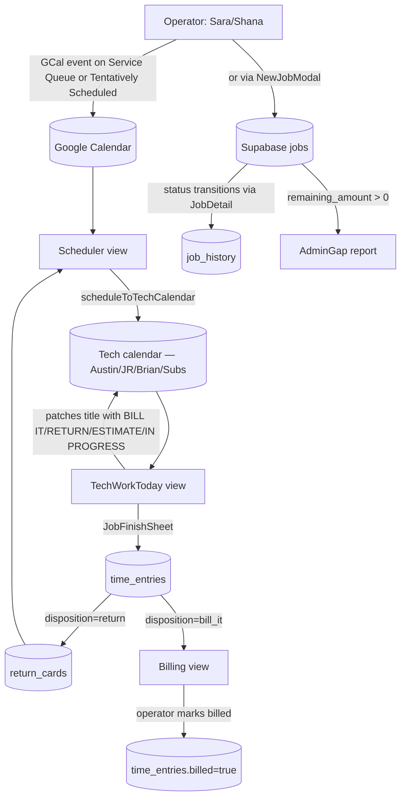
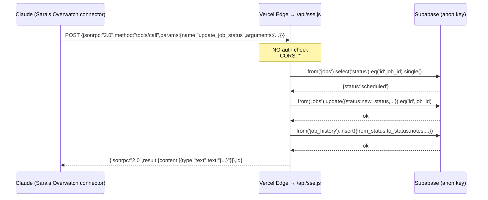

# Overwatch — Full Code Review

**Repo:** `overwatch-highsidesecurity-com` (internal name `juce-v4` — see `package.json:2`)
**Deployed:** `https://overwatch-highsidesecurity-com.vercel.app`
**Reviewed:** May 9, 2026 — against working tree as cloned to `~/code/overwatch.highsidesecurity.com`
**Reviewer:** Augment (read-only review, no code edits made)

> Conventions: every claim cites `path:line`. Where a fact cannot be verified from
> the code (e.g., production env vars, RLS state in the live DB, what Lifeline
> actually contains), the report says so explicitly rather than inferring.

---

## Pass 1 — Architecture & Integration Map

### 1.1 Repo shape

```
api/sse.js              # Single Vercel serverless function — the MCP server
src/                    # Vite + React 18 SPA (the "Overwatch" dashboard)
  App.jsx               # Router + auth + USER_CONFIG
  config/               # calendars.js, roles.js  (hardcoded GCal IDs + role table)
  services/             # supabase.js, calendarSync.js, eventParser.js, pushNotifications.js
  utils/                # statusMachine.js, alertEngine.js, usePullToRefresh.jsx
  components/           # JobFinishSheet, JobDetail, NewJobModal, HelpBot, etc.
  views/                # BoardView, OfficeHub, TechCalendar, Queue, Billing, etc.
supabase/migrations/    # 4 SQL files (see §1.4 — only partial schema)
public/                 # firebase-messaging-sw.js, icons, manifest.json
temp_patch/              # ~250 KB of an EARLIER copy of the source — see §2.2
vercel.json             # rewrites + permissive CORS headers
package.json            # name=juce-v4 version=4.0.0 — README says "Overwatch V3"
README.md               # STALE — claims "No database. No Supabase." (it has both)
CHANGES.md              # JobFinishSheet consolidation notes (May 7, 2026)
```

Top-of-file headers are inconsistent about which version this is: comments say
`JUC-E V3` (`src/services/calendarSync.js:2`), `JUC-E V4` (`src/components/HelpBot.jsx:2`,
`src/services/supabase.js:2`), `JUC-E V6` (`src/views/AdminGap.jsx:2`),
`v7.3` in commit `db4fe30`, and `APP_VERSION = '7.2.0'` in `src/App.jsx:29`.

### 1.2 HTTP entry points (`api/`)

The repo has exactly **one** server file. There is no `pages/api/` or `app/api/`.

| Method | Path | Purpose | Returns | File |
|---|---|---|---|---|
| `OPTIONS` | `/api/sse` | CORS preflight (allow-all) | `200` empty | `api/sse.js:578-580` |
| `GET` | `/api/sse` | Open SSE stream — sends one `connected` event then `: keepalive` every 30 s | `text/event-stream` | `api/sse.js:583-601` |
| `POST` | `/api/sse` | JSON-RPC 2.0 dispatch for MCP `initialize` / `tools/list` / `tools/call` | `application/json` | `api/sse.js:604-658` |
| any other | `/api/sse` | — | `405 Method not allowed` | `api/sse.js:660` |

`vercel.json:3` rewrites `/api/sse → /api/sse.js` and `vercel.json:4` rewrites
all non-`/api/` paths to `/index.html` (SPA fallback). CORS is wildcard at both
the rewrite layer (`vercel.json:8-12`) and inside the handler
(`api/sse.js:574-576`).

The MCP "SSE" implementation is **not actually streaming tool results**. The
`GET` handler only emits a heartbeat; every real tool call goes over a separate
`POST` and gets a single JSON response. Claude's MCP client treats this as a
transport, but the long-lived `setInterval(..., 30000)` on Vercel Serverless
will run until Vercel's max function duration (default 10 s on Hobby, 60 s on
Pro) cuts it off — see §2.5.

### 1.3 MCP tools (POST `/api/sse` with `{method:"tools/call",params:{name,arguments}}`)

All 16 tools listed in the brief are present in `api/sse.js:50-200`. Per-tool detail:

| # | Tool | Reads | Writes | Notes / status |
|---|---|---|---|---|
| 1 | `get_dashboard_stats` (`api/sse.js:206-225`) | `jobs` (full table scan, filter in JS) | — | Works. **Inefficient**: pulls every non-terminal job to count statuses client-side. |
| 2 | `get_jobs_by_status` (`:227-237`) | `jobs` | — | Works. No status whitelist enforced — caller can pass any string. |
| 3 | `get_billing_queue` (`:239-246`) | `jobs` (status in `to_bill, needs_estimate, estimate_sent, won`) | — | Works. |
| 4 | `get_scheduling_queue` (`:248-255`) | `jobs` (status in `ready_to_schedule, return_pending`) | — | Works. |
| 5 | `get_triage_queue` (`:257-264`) | `jobs` (status in `new, needs_details, needs_parts, pending_materials`) | — | Works. |
| 6 | `search_customers` (`:266-276`) | `customers` (`ilike` on name/phone/address/cms_account_id) | — | Works. **Injection risk** — `query` is interpolated into the `.or()` string with no escaping; commas / parens / `,` could break the filter or leak rows. See §2.3. |
| 7 | `get_customer_history` (`:278-293`) | `customers`, `jobs` | — | Works. Two sequential queries (could be parallel). |
| 8 | `get_job_details` (`:295-316`) | `jobs`, `job_history`, `job_assignments` (joined to `techs`) | — | Works. Three sequential queries — easy to parallelize. |
| 9 | `update_job_status` (`:318-353`) | `jobs` | `jobs.status`, `job_history` | **Skips `statusMachine` validation.** Despite the description "follows the status machine rules," the handler never imports `VALID_TRANSITIONS` (`src/utils/statusMachine.js:8-26`) and accepts any `new_status` string — including ones not in the enum at all. See §2.1. |
| 10 | `add_job_note` (`:355-379`) | `jobs.status` | `job_history` (with `from_status == to_status`) | Works, but writes to `job_history` table — there is no separate notes table for jobs (that table is for `notesApi` in supabase.js, see §1.4). Subtle: callers using `notesApi.getAllForJob()` won't see these notes. |
| 11 | `get_techs` (`:381-388`) | `techs` (`is_active=true`, ordered by `display_order`) | — | Works. |
| 12 | `get_calendar_ids` (`:390-392`) | — (returns hardcoded `CALENDARS`) | — | Works. **Diverges** from `src/config/calendars.js:36-66` — the SSE copy is missing `BRIAN`, `TREVOR`, `SUBS`, `SHANA_NOTES`, `SCHEDULING_NOTES`, etc. See §2.2. |
| 13 | `create_job` (`:394-435`) | `jobs` (last job number) | `jobs` | Works, but **race condition** on `job_number` generation — concurrent `create_job` + `create_return_visit` calls will collide on the same `DRH-N+1`. See §2.1. Also bypasses `jobsApi.create()` so `customer_id` is never linked even if name matches an existing customer. |
| 14 | `get_gap_report` (`:437-452`) | `jobs` (`remaining_amount > 0`) | — | Works. Returns top 50 by remaining amount and the running total. Mirrors `AdminGap.jsx`. |
| 15 | `create_return_visit` (`:454-513`) | `jobs` (parent + last number) | `jobs`, `job_history` | Works. Same job-number race as #13. Inherits parent's `customer_id`, `priority`, `customer_*` fields. Hardcodes `status='return_pending'` regardless of parent status. |
| 16 | `get_job_family` (`:515-563`) | `jobs` (parent, siblings, children) | — | Works. Up to 4 sequential round-trips — could be 1 with a single `or` query. |

End-to-end: all 16 tools execute without throwing **assuming the referenced
tables/columns exist in the live DB**. The repo only ships migrations for
`time_entries`, `return_cards`, and column-additions to `jobs` (see §1.4) —
the `jobs`, `customers`, `techs`, `job_history`, `job_assignments`,
`activity_log`, `feedback`, `push_tokens`, `clock_events`, `pl_data`,
`overrun_stats`, `installations_pending_approval`, `jobs_needing_followup`,
`satisfaction_metrics` tables/views must have been created by hand or in a
prior repo. The **column shape of `jobs`** that tools #1, #13, #14 assume —
`status`, `estimate_amount`, `remaining_amount`, `parent_job_id`, `job_number`,
`customer_id`, `customer_name/phone/address`, `priority`, `job_type`,
`updated_at/by` — matches what `src/services/supabase.js` and
`src/views/AdminGap.jsx` write.

### 1.4 Database schema (reverse-engineered)

Migration files in `supabase/migrations/` only cover three tables and a few
column additions. Every other table is referenced by client code without a
migration in the repo.

**Tables WITH migration files:**

| Table | File | Purpose |
|---|---|---|
| `time_entries` | `001_time_entries_and_returns.sql:13-47` | One row per tech finish action. Cols: `id`, `customer_id`→customers, `customer_name_raw`, `calendar_event_id`, `calendar_id`, `event_title`, `event_start`, `tech_email`, `tech_name`, `time_in`, `time_out`, `total_minutes`, `entry_method` ∈ {`manual,inout,timer`}, `disposition` ∈ {`bill_it,return,estimate,in_progress`}, `notes`, `billed`, `billed_at`, `invoice_ref`, `created_at`. Indexes on `customer_id`, `calendar_event_id`, `disposition`, partial-on-unbilled, `(tech_email, created_at desc)`. |
| `time_entries` (extension) | `002_time_entries_materials.sql:3` + `003_time_entries_project_ref.sql:4-6` | Adds `materials TEXT` and `project_ref TEXT` (with partial index). |
| `return_cards` | `001_time_entries_and_returns.sql:60-89` | Cols incl. `customer_id`, `original_event_id/calendar_id/title/location`, `flagged_by_email/name`, `reason`, `time_entry_id`→time_entries, `status` ∈ {`pending_schedule,scheduled,cancelled,complete`}, `scheduled_at`, `new_event_id/calendar_id`. Indexes on status + partial-on-pending. Trigger `touch_return_cards_updated_at`. |
| `jobs` (extension) | `002_job_linking.sql:14-20` | Adds `p_number TEXT`, `s_number TEXT`, `blocked_tags TEXT[]`, with unique partial indexes on `p_number`/`s_number` and a plain index on `status`. |

**Tables referenced by code but with NO migration in this repo** (column shape
inferred from query bodies):

| Table | Inferred columns | Read/written from |
|---|---|---|
| `jobs` | `id`, `job_number` (text — `DRH-NNNN`), `customer_id`→customers, `customer_name`, `customer_phone`, `customer_address`, `gate_code`, `panel_password`, `status` (enum, see `src/services/supabase.js:23-41`), `job_type`, `priority`, `issue`, `parent_job_id`→jobs, `p_number`, `s_number`, `blocked_tags`, `estimate_amount`, `invoice_amount`, `remaining_amount`, `qbo_estimate_status`, `invoice_id`, `calendar_event_id`, `collected_at`, `manager_approved_by/at`, `manager_approval_notes`, `completion_notes`, `scheduled_at`, `completed_at`, `billed_at`, `created_by`, `updated_by`, `created_at`, `updated_at` | `api/sse.js`, `src/services/supabase.js:219-401`, `src/views/AdminGap.jsx:54-91`, `src/components/JobDetail.jsx`, `src/components/NewJobModal.jsx` |
| `customers` | `id`, `name`, `phone`, `address`, `cms_account_id`, `is_active` | `api/sse.js:266-292`, `src/services/supabase.js:115-217`, `src/components/CustomerLookup.jsx` |
| `techs` | `id`, `name`, `color`, `display_order`, `is_active` | `api/sse.js:381-388`, `src/services/supabase.js:67-113` |
| `job_history` | `id`, `job_id`→jobs, `from_status`, `to_status`, `notes`, `changed_by`, `changed_at` | `api/sse.js:303-377`, `src/services/supabase.js:289-293` |
| `job_assignments` | `id`, `job_id`→jobs, `tech_id`→techs, `scheduled_for`, `is_complete`, `time_in`, `time_out`, `completion_notes`, `calendar_event_id`, `calendar_id` | `api/sse.js:309-313`, `src/services/supabase.js:407-508`, `src/components/JobDetail.jsx:282-287` |
| `feedback` | `type`, `message`, `user_email`, `current_view`, `metadata`, `created_at` | `src/services/supabase.js:558-575`, `src/components/HelpBot.jsx:638` |
| `activity_log` | `event_type`, `calendar_event_id`, `created_at` (used as upsert key on `calendar_event_id`) | `src/services/calendarSync.js:284-298` — **upsert assumes a UNIQUE constraint on `calendar_event_id` that no migration defines.** See §2.1. |
| `push_tokens` | (used by `pushNotifications.js`) | `src/services/pushNotifications.js` |
| `pl_data` | imported P&L numbers | `src/components/PLDashboard.jsx`, `src/components/PLUpload.jsx` |
| `overrun_stats` (view?) | tech overrun summary | `src/services/supabase.js queries` |
| `installations_pending_approval` (view?) | install jobs awaiting manager sign-off | `src/components/InstallationApprovalModal.jsx` |
| `jobs_needing_followup` (view?) | dashboard list | `src/services/supabase.js queries` |
| `satisfaction_metrics` (view?) | survey summary | `src/services/supabase.js queries` |
| `clock_events` | tech clock-in/out events | `src/services/supabase.js queries` |

**RPC functions:** exactly one (`src/services/supabase.js:901`):
`supabase.rpc('assign_s_number', { target_job_id })`. Definition is not in
this repo's migrations.

**RLS:** the only policies committed are on `time_entries` and `return_cards`
(`001_time_entries_and_returns.sql:99-106`):
`CREATE POLICY ... FOR ALL USING (true) WITH CHECK (true)` — i.e. wide-open
to anyone with the anon key. Whether `jobs`, `customers`, `techs`,
`job_history`, etc. have stricter RLS in production cannot be determined
from the repo.

### 1.5 External integrations

| Integration | Where | Credential | Failure mode |
|---|---|---|---|
| **Supabase** (REST + Realtime) | `src/services/supabase.js:9-11`, `api/sse.js:11-13`, `src/views/AdminGap.jsx:9` | `VITE_SUPABASE_URL`, `VITE_SUPABASE_ANON_KEY` — **both have hardcoded fallbacks containing the real production project URL and a real anon JWT** (see §2.3). Also re-instantiates a separate client inside `api/sse.js`. | If env missing: still works via fallback (which is the security problem). If Supabase down: most call sites swallow with `console.warn` (e.g. `src/services/supabase.js:292`, `calendarSync.js:288`); some surface to the UI with `setError`. |
| **Google Calendar v3** (REST) | `src/services/calendarSync.js:10-65`, also re-implemented inline in `src/views/CommandCenter.jsx:163-176`, `src/components/JobFinishSheet.jsx:35,79` and others | OAuth bearer (`accessToken`) from Google Identity Services in `src/App.jsx`. Scope: `openid email profile https://www.googleapis.com/auth/calendar https://www.googleapis.com/auth/gmail.readonly` (`src/App.jsx:31`). | If 401: token expiry handler in `App.jsx` triggers re-auth via hidden iframe. Archive failures silently logged (`calendarSync.js:101`); patch-after-create failures warn and continue (`calendarSync.js:87`). |
| **Google OAuth / GIS** | `src/App.jsx` (script loaded in `index.html`) | `VITE_GOOGLE_CLIENT_ID` (no fallback — login fails if unset). 36-hour session expiry stored in `localStorage.juce_v4_expiry`. | Token persisted in `localStorage`; checked every 5 min. |
| **Gmail API** | scope requested but no `gmail.googleapis.com` calls in the source | — | Unused at present (dead scope). |
| **Firebase Cloud Messaging** | `src/services/pushNotifications.js`, `public/firebase-messaging-sw.js` | `VITE_FIREBASE_*` env vars (seven standard FCM web-config keys); **none documented in `.env.example`** which only lists `VITE_GOOGLE_CLIENT_ID`. | If keys missing: FCM init throws; `NotificationBell.jsx` falls back to permission-denied state. |
| **Anthropic Claude API** | `src/components/HelpBot.jsx:10` (`VITE_ANTHROPIC_API_KEY`) | API key shipped in client bundle if set — see §2.3. | If unset: HelpBot falls back to scripted/canned responses only. |
| **QuickBooks Online** | **Not present.** `qbo_estimate_status` and `invoice_id` columns exist on `jobs` but are read-only references — no QBO API client in the repo. | — | The "billed" lifecycle is manual: a human flips `status` to `billed` from the UI. |
| **Twilio / SMS** | **Not present.** No Twilio import, no `twilio.com` URL. | — | SMS-style alerts are actually FCM push notifications via `notifyJobAssigned` etc. |

### 1.6 Auth model

**Browser (SPA):**
- Sign-in via Google Identity Services. The OAuth flow yields an access token
  used as a bearer for both Calendar and Gmail (`src/App.jsx:31`).
- Identity is the **email address** of the signed-in Google account.
- `USER_CONFIG` (`src/App.jsx:33-45`) maps a hardcoded list of emails to
  `{name, role, defaultCalendar, defaultView}`. Anyone NOT in this map gets
  `role: 'tech'` with `defaultCalendar: null` (`src/App.jsx:67`) — i.e. they
  can still use the app, just without operator routes.
- The only client-side gate is `<OperatorOnly>` around `/command`, `/office`,
  `/dashboard`, `/admin/gap` (`src/App.jsx:559-567`). This is **UI gating only**
  — there is no server-side authorization on Supabase queries beyond RLS
  (which, per §1.4, is wide-open on the tables we have migrations for).
- A second blocking gate `<StuckAlertGate>` shows for `jr@drhsecurityservices.com`
  every 6 hours (`src/App.jsx:362-368`) — UX, not security.

**MCP server (`api/sse.js`):**
- **No authentication of any kind.** No bearer check, no `x-api-key`, no IP
  allowlist, no Vercel password protection in `vercel.json`. CORS is wildcard
  (`vercel.json:8-12` and `api/sse.js:574-576`). Anyone who knows the URL
  `https://overwatch-highsidesecurity-com.vercel.app/api/sse` can:
  - List all jobs in any status
  - Search any customer by partial name/phone/address
  - Read a customer's full history (PII: name, address, phone, gate codes via
    job description)
  - **Write**: create jobs, change job status, create return visits, write to
    `job_history`
- This is the highest-impact finding in the report. See §2.3 P0-1.

### 1.7 Data flow diagrams

**(a) Job lifecycle (calendar-driven, the path most jobs actually take):**



**(b) MCP tool call path:**



---

## Pass 2 — Bug Hunt, Dead Code & Security

### 2.1 Bugs (real, observable broken behavior)

#### B-1 — `update_job_status` claims to enforce status-machine rules but doesn't (`api/sse.js:117-128`, `:318-353`)

The tool description says *"This follows the status machine rules."* The handler
never imports `VALID_TRANSITIONS` (`src/utils/statusMachine.js:8-26`) or calls
`canTransition()`. It accepts any string for `new_status`, so Claude can ask it
to set `status='haunted'` and the DB will happily store that — every UI view
that switches on status will then either silently drop the job from its bucket
or render an unknown-status placeholder. Even valid-but-disallowed transitions
(e.g. `archived → scheduled`, which `VALID_TRANSITIONS[ARCHIVED]=[]` forbids)
go through. **Impact:** Claude can corrupt the job state machine; UI breaks
silently.

#### B-2 — `create_job` / `create_return_visit` race on `job_number` (`api/sse.js:406-414`, `:467-475`, also `src/services/supabase.js:314-322`)

Both implementations do `select job_number order by created_at desc limit 1`
then `parseInt + 1` then `INSERT`. There is no DB-side sequence and no
unique constraint shown in the migrations. Two concurrent calls — including
one from the SPA's `NewJobModal` and one from Claude — will both read
`DRH-5042` and both insert `DRH-5043`. The same logic appears three times
across the codebase. **Impact:** silently corrupted job numbering during
concurrent use.

#### B-3 — `add_job_note` writes to the wrong table (`api/sse.js:355-379`)

The handler stores notes as fake transitions in `job_history` with
`from_status === to_status`. The SPA's notes UI uses `notesApi`
(`src/services/supabase.js:510-556`) which reads from a separate `notes`
table. **Impact:** notes added by Claude are invisible to the field/operator
UI, and notes added in the UI are invisible to Claude's `get_job_details`
(which only reads `job_history`).

#### B-4 — `CommandCenter.handleSchedule` passes a tech ID where a calendar ID is required (`src/views/CommandCenter.jsx:152-158`)

```js
const newEvent = await createEventOnCalendar(accessToken, selectedTech.id, { ... });
```

`createEventOnCalendar(accessToken, calendarId, ...)` (`src/services/calendarSync.js:72`)
expects a Google Calendar ID, not a tech UUID from Supabase. Compare with the
correct usage in `src/components/ScheduleModal.jsx:277` which calls
`scheduleToTechCalendar(accessToken, job, selectedTech, scheduledFor)` —
that helper resolves `getTechCalendarId(tech)` first
(`calendarSync.js:148-149`). The CommandCenter path will fail with a 404
from Google Calendar at runtime any time it's used. **Impact:** the schedule
action in CommandCenter is broken.

#### B-5 — `Billing.parseEvent` shadows the imported `eventParser.parseEvent` (`src/views/Billing.jsx:43`)

`Billing.jsx` has a local `function parseEvent(ev, cal)` defined, while
`TechView.jsx`, `OwnerView.jsx`, and `TechTodayView.jsx` import the
canonical one from `src/services/eventParser.js`. Two different parsers ⇒
two different bucketing rules for the same calendar event ⇒ Billing and
Queue can disagree about whether something is `bill_it`/`return`/etc.
**Impact:** subtle disagreement between Billing and Queue counts; visible
when legacy tags vs. canonical tags appear together.

#### B-6 — `activity_log` upsert assumes a UNIQUE constraint that's not in any migration (`src/services/calendarSync.js:284-298`)

```js
await supabase.from('activity_log').upsert(
  { event_type: 'orphan_ignored', calendar_event_id: eventId, ... },
  { onConflict: 'calendar_event_id' }
);
```

For Supabase to do `ON CONFLICT (calendar_event_id) DO UPDATE`, the column
needs a unique index. None is defined in any committed migration. If the
column isn't unique in production either, the upsert silently degrades to
an insert — duplicate rows pile up and "ignored orphan" state grows
unbounded. The error is swallowed by `console.warn` so no UI feedback.

#### B-7 — `JOB_STATUS.COMPLETE` referenced but never produced by any UI flow (`src/utils/statusMachine.js:17`, `src/services/supabase.js:38,52,278`)

`STATUS_INFO[JOB_STATUS.COMPLETE]` is defined and `changeStatus` sets
`completed_at` for it, but every `COMPLETE_*` action in `ACTIONS`
(`statusMachine.js:40-45`) routes to `TO_BILL` / `RETURN_PENDING` /
`NEEDS_ESTIMATE` / `BILLED` / `NEEDS_PARTS` — never to `COMPLETE`. Only
the MCP `update_job_status` tool can land jobs in `COMPLETE`, and once
there `VALID_TRANSITIONS[COMPLETE]=[TO_BILL, RETURN_PENDING, NEEDS_ESTIMATE, BILLED]`
keeps them visible. Mostly cosmetic — but it means `get_dashboard_stats`'s
"complete" bucket (which it doesn't actually track separately) and any
analytics that filter by `status='complete'` will essentially always be
empty.

#### B-8 — Hardcoded prod deep-link points at the WRONG domain (`src/services/calendarSync.js:83`)

```js
const deepLink = `https://juc-e-v2.vercel.app/?cal=...&job=...`;
```

Every event created via `createEventOnCalendar` (i.e. ScheduleModal,
OfficeHub auto-schedule, CommandCenter) gets a description with a deep
link to the **old** `juc-e-v2.vercel.app` deployment, not
`overwatch-highsidesecurity-com.vercel.app`. **Impact:** when a tech taps
"Open in JUC-E" from a calendar event, they hit a defunct URL.

#### B-9 — `JobDetail.submitCompletion` doesn't await side effects before clearing state (`src/components/JobDetail.jsx:272-308`)

`assignmentsApi.markComplete`, `jobsApi.changeStatus`, and the auto-assign
to JR are awaited, but `notifyJobComplete`/`notifyStatusChange`
(`:291-293`) are NOT awaited — they're fire-and-forget. If FCM throws
synchronously (e.g. unregistered service worker), the error escapes the
`try`/`catch` boundary and the `finally`-block reset still runs. Lower
severity, but worth noting because the UI claims the action succeeded
even when the notification side effect failed.

#### B-10 — `assignmentsApi.markComplete` arg shape: `null, null` trailing (`src/components/JobDetail.jsx:284-286`)

```js
await assignmentsApi.markComplete(activeAssignment.id, timeIn, timeOut, notes || null, null, null);
```

The trailing `null, null` correspond to fields that are accepted by the API
but never used here — likely `materials` and `disposition`. Means the
JobDetail completion path is missing the materials field that's been added
elsewhere (commit `c72e6d7`, `0c781c7`). Discrepancy between the Detail
flow and the canonical `JobFinishSheet` flow.

#### B-11 — Three different Supabase clients are instantiated (`src/services/supabase.js:11`, `api/sse.js:13`, `src/views/AdminGap.jsx` imports both `supabase` and re-uses it correctly, but the client instantiation in `api/sse.js` is a parallel copy)

Each client maintains its own auth/realtime channel. `api/sse.js`'s anon
key is duplicated verbatim from `src/services/supabase.js` — when the key
rotates you must edit both places. Already a maintenance hazard; will
become a bug.

#### B-12 — `feedback` table insert uses snake_case key inconsistent with rest of API (`src/services/supabase.js:558-575`)

`feedbackApi.create` writes `userEmail`, `currentView`, `metadata` as object keys, but every other `*Api.create` in this file uses snake_case (`customer_id`, `tech_id`, `created_by`). Either the `feedback` table has camelCase columns (atypical for Postgres), or this insert is silently dropping fields. Without seeing the table definition I can't be 100% sure, but it's worth checking.

#### B-13 — Duplicate migration numbering (`supabase/migrations/002_*`)

Two files both numbered `002`: `002_job_linking.sql` and
`002_time_entries_materials.sql`. Supabase CLI applies in lexical order
(materials would run after job_linking), but any tool that keys by the
numeric prefix will conflict. Cosmetic in this repo but trips up any
future migration tooling.

### 2.2 Dead code / orphaned files

| Path | Status | Why |
|---|---|---|
| `temp_patch/` (entire directory, ~250 KB) | **Stale duplicate of `src/`** | Contains an earlier copy of the source (`temp_patch/README.md` is byte-identical to the stale root `README.md`, the file list under `temp_patch/src/` mirrors `src/` but differs by 5–20 lines per file). It is not gitignored (`.gitignore` lists only `node_modules/dist/.env*`). Notably, `temp_patch/.vercel/project.json` exposes the project's `projectId` and `orgId` — see §2.3 P1-3. **Action: delete the whole directory.** |
| `src/components/EnhancedDashboardMetrics.jsx` | Imported nowhere | grep across `src/` returns 0 importers. Safe to remove. |
| `src/views/OwnerView.jsx` | Imported nowhere | Replaced by `OwnerDashboard.jsx` long ago. |
| `src/views/TechView.jsx` | Imported nowhere | Replaced by `TechWorkToday.jsx` and `TechCalendar.jsx`. |
| `src/views/TechTodayView.jsx` | Imported nowhere | Replaced by `TechWorkToday.jsx`. Has its own `parseEventDescription`/`parseEventStatus` that nothing else uses. |
| `src/utils/scheduleValidation.js` | Imported nowhere | Likely fossil from an earlier scheduling flow. |
| `/lifeline` route (`src/App.jsx:548-556`) | Placeholder | Renders only "Coming soon." Currently does nothing — see §3.5. |
| `gmail.readonly` OAuth scope (`src/App.jsx:31`) | Unused | No `gmail.googleapis.com` API calls anywhere. Removing reduces consent friction. |
| `JOB_STATUS.PENDING_DECISION` | Effectively dead | `STATUS_INFO` defines it, `VALID_TRANSITIONS` allows exits but no entry point — comment at `statusMachine.js:12` literally says "legacy — can move out only". |
| Legacy modal stubs | **Already removed** per `CHANGES.md` (`CompletionModal.jsx`, `JobCompleteModal.jsx`, `TimeCaptureModal.jsx`, `JobStatus.jsx`, `overrunDetection.js`). The deletes are reflected in the working tree. The dead references in HelpBot's TEAM_FACTS pep talks (`src/components/HelpBot.jsx:181,924,928,930,944`) refer to the **988 Suicide & Crisis Lifeline** mental-health resource, not the Lifeline app — keep those. |
| `materials TEXT` migration is split across 002 + JobDetail not using it | See B-10 |
| `subscriptions` export in `supabase.js` (`:952`) | Used in 0 files | Realtime channels exported but nothing subscribes. Verified via grep. |
| `roles.js` | Imported in 0 places (`grep -rn "from.*config/roles"` returns 0) | Role enum exists but every role check inlines email comparisons in `App.jsx:33-45` and `JobDetail.jsx:197`. |
| `getValidNextStatuses` / `STATUS_GROUPS.FLIGHT_DECK` etc. | Used very thinly | Worth auditing but not safe to delete blindly. |

### 2.3 Security

#### P0-1 — MCP SSE endpoint is wide open to the internet (`api/sse.js:572-660`, `vercel.json:6-13`)

There is no authentication on `/api/sse`. With the URL alone, anyone can:

- `POST {jsonrpc:"2.0",method:"tools/call",params:{name:"create_job",arguments:{customer_name:"X",issue:"Y",created_by:"attacker@evil.com"}},id:1}` and create jobs.
- Call `update_job_status` to flip any job to `archived` / `dead` / `billed`.
- Call `search_customers` with `query:""` to enumerate the customer table (PII: name, phone, address, CMS account ID).
- Call `get_customer_history` and `get_job_details` to dump per-customer job and history data — including `gate_code`, `panel_password`, `customer_phone`, `customer_address` returned in the raw `jobs.*` payload.

This is the single most damaging finding. **Mitigations**, in order of effort:

1. Add a shared-secret check (`x-mcp-secret` header) gated by an env var Claude is configured with. Claude's MCP connector supports custom headers.
2. Move from CORS `*` to allowlist (Claude's connector hits from a known origin, but JSON-RPC over `POST` with no `Origin` from server-to-server breaks CORS-as-auth — this is defense in depth, not the primary control).
3. Consider Vercel's built-in `vercel.json` IP allowlist or password protection if the connector is only invoked from a single egress.

#### P0-2 — Real Supabase URL + anon JWT hardcoded as fallback in two places (`src/services/supabase.js:9-10`, `api/sse.js:11-12`)

```js
const supabaseUrl = ... || 'https://wolhqelloeypafmmvapn.supabase.co';
const supabaseKey = ... || 'eyJhbGciOiJIUzI1NiIs...wQZ14FMQ03A8cBYXBMS1-pII4lKhTL7VNPl9zBCs-EM';
```

The anon JWT decodes to `{role:"anon", iss:"supabase", iat:1769284185, exp:2084860185}` — issued in early 2026, expires in 2036. Anon keys are designed to be public **only when paired with non-trivial RLS**. Per §1.4 the only RLS we can verify (`time_entries`, `return_cards`) is `USING (true)`, and we cannot confirm RLS on the rest of the tables from this repo. The combination of "wide-open RLS where we can see it" + "key shipped in client bundle and serverless" + "URL and key both in the JS source as a fallback so they survive a missing-env deploy" means the key is effectively public. The actual blast radius depends on RLS policies that are not in the repo — but the code here treats the key as a plain text constant.

**Mitigations:** remove the hardcoded fallbacks; require env vars and crash early if missing. Audit RLS in the live DB for `jobs`, `customers`, `techs`, `job_history`, `job_assignments`, `feedback`, `push_tokens`, `pl_data`. If you need server-side privileged ops from `api/sse.js`, switch it to a `SUPABASE_SERVICE_ROLE_KEY` env var (server-only, not `VITE_*`), and gate every tool with the auth from P0-1.

#### P0-3 — `search_customers` is a Supabase `.or()` filter built from unescaped user input (`api/sse.js:266-276`)

```js
.or(`name.ilike.%${query}%,phone.ilike.%${query}%,address.ilike.%${query}%,cms_account_id.ilike.%${query}%`)
```

`query` comes straight from MCP arguments. The supabase-js `.or()` parser treats commas, parens, and dots as syntax. A query like `x,is_active.eq.false,name.like.*` rewrites the filter shape and bypasses the `is_active=true` filter that's applied separately above (`.eq('is_active', true)` is ANDed into the WHERE clause, but a malicious `or()` payload can OR additional disjuncts that match inactive rows). Even if the worst case is "see slightly more rows than intended," for a public endpoint that's still a data-leakage bug. **Mitigation:** escape commas/parens/percent in `query` before interpolation; or use multiple `.or()` segments built from sanitized tokens. The same pattern repeats in `src/services/supabase.js:121-127, 295-302`.

#### P1-1 — `VITE_ANTHROPIC_API_KEY` would ship in the client bundle if set (`src/components/HelpBot.jsx:10`)

`import.meta.env.VITE_*` is inlined at build time and exposed to browsers. Currently the deployed build appears not to have this set (HelpBot falls back to scripted responses), but if anyone enables it, the Anthropic key becomes public. **Mitigation:** proxy Claude calls through `api/sse.js` (or a sibling serverless route) using a server-only secret.

#### P1-2 — Permissive RLS on `time_entries` and `return_cards` (`supabase/migrations/001_*:99-106`)

`USING (true) WITH CHECK (true)` means anyone with the anon key can read/write/delete every row. Combined with P0-2, anyone on the internet can rewrite billing data. **Mitigation:** scope policies to `auth.uid()` or to known service identities; if RLS-by-user is impractical because of the shared `info@` login, at minimum gate writes to a server-side route using the service role key.

#### P1-3 — `temp_patch/.vercel/project.json` is committed (`temp_patch/.vercel/project.json`)

```
{"projectId":"prj_XMtQ4tYD5g71UTAdvhKFKyJdrkWN","orgId":"team_04Mlk4zSOl2Ylaw8z9e6Zmv2","projectName":"overwatch-highsidesecurity-com"}
```

These IDs aren't secret in the strict sense, but they let an attacker target Vercel-specific endpoints and they shouldn't be in source. `.gitignore` does not list `.vercel/`. **Mitigation:** delete the whole `temp_patch/` directory (see 2.2) and add `.vercel/` to `.gitignore`.

#### P1-4 — PII in tool responses by default (`api/sse.js:295-316, 437-452`)

`get_job_details`, `get_gap_report`, `get_billing_queue`, `get_jobs_by_status` all return `select('*')` from `jobs` — which includes `customer_phone`, `customer_address`, `gate_code`, `panel_password`. Whatever Claude passes to the user could be recorded in their chat history or, depending on the connector, sent through Anthropic. Consider returning an explicit allowlist of fields (and a separate `get_job_secrets(job_id)` tool gated by an extra check for `gate_code` / `panel_password`).

### 2.4 Performance

| Issue | Where | Cost | Fix |
|---|---|---|---|
| `get_dashboard_stats` does 1 full-table scan + JS filtering | `api/sse.js:206-225` | Pulls every non-terminal job over the wire to count them | Replace with one `count(*) ... group by status` RPC, or 6 parallel `head: true, count: 'exact'` queries. |
| `get_job_details`, `get_job_family` do 3–4 sequential round trips | `api/sse.js:295-316`, `:515-563` | Latency = sum of round-trips | Parallelize with `Promise.all`. |
| `get_billing_queue` / `get_scheduling_queue` / `get_triage_queue` lack a `.limit()` | `api/sse.js:243, 252, 261` | Unbounded payloads as DRH grows | Add a default `limit(100)` and `order by` an index column. |
| `BoardView.jsx` is 2,290 lines, `OfficeHub.jsx` 1,475, `TechCalendar.jsx` 1,278 | (see size table below) | Re-renders re-walk huge component trees | Split. P2 — see refactor plan. |
| `scanForOrphans` does N×M sequential calls (`per-calendar fetch → per-event Supabase lookup`) | `src/services/calendarSync.js:211-233` | Slow at startup of TechCalendar | Batch the `assignmentsApi.getByCalendarEventId` lookups. |
| The SSE `GET` handler holds a connection open with `setInterval(... 30000)` | `api/sse.js:592-598` | On Vercel Serverless this counts against function execution time/billing; will be killed at the function timeout | Either move to a real edge runtime / Durable Object / Vercel Functions with `Edge` + streaming, or document that "the SSE GET is a no-op heartbeat and Claude only uses the POST". |
| Realtime subscriptions exported but nobody subscribes (`src/services/supabase.js:952`) | — | Dead code; benign | Remove. |

**File size hot spots** (lines):

| File | Lines |
|---|---|
| `src/views/BoardView.jsx` | 2,290 |
| `src/views/OfficeHub.jsx` | 1,475 |
| `src/views/TechCalendar.jsx` | 1,278 |
| `src/components/JobDetail.jsx` | 1,185 |
| `src/views/OwnerDashboard.jsx` | 1,095 |
| `src/components/HelpBot.jsx` | 1,089 |
| `src/views/TechTodayView.jsx` (dead) | 983 |
| `src/views/Scheduler.jsx` | 962 |
| `src/views/Queue.jsx` | 851 |
| `src/views/Billing.jsx` | 848 |
| `src/components/NewJobModal.jsx` | 845 |

### 2.5 Error handling

| Issue | Where | Effect |
|---|---|---|
| Half-write window in `update_job_status` | `api/sse.js:331-350` | If the `jobs.update` succeeds but the `job_history.insert` fails (network blip), the status changes with no audit trail. Wrap both in a Postgres function or do the insert first and `ON CONFLICT DO NOTHING` on the update. |
| Half-write window in `create_return_visit` | `api/sse.js:478-504` | If the new job inserts but the parent's `job_history` insert fails, the linked job exists with no record on the parent. |
| Half-write in `JobDetail.submitCompletion` | `src/components/JobDetail.jsx:272-308` | The flow does: mark assignment complete → change job status → notify → loadJob. If the second `await` throws, the assignment is marked complete but the job stays in its old status. |
| Errors swallowed by `console.warn` | `calendarSync.js:87,101,288,298,313`, `supabase.js:292`, many places | Background failures (deep-link patch, archive, history log, ignored-orphan upsert) leave the user thinking the action succeeded. At minimum surface a small toast. |
| `notifyJobComplete` / `notifyStatusChange` not awaited | `src/components/JobDetail.jsx:291-293` | Sync throws escape the try/catch boundary. (B-9 above.) |
| `apiDelete` in calendarSync re-throws on non-404 errors | `src/services/calendarSync.js:55` | Good — but the `archiveEvent` wrapper catches all of it (`:96-104`), so the user never sees the failure either way. |

---

## Pass 3 — Refactor Plan

### 3.1 P0 — fix this week (security, data corruption, broken core flows)

| # | Task | Cite | Effort |
|---|---|---|---|
| P0-A | **Authenticate the MCP endpoint.** Add an `x-mcp-secret` header check in `api/sse.js:572` (env: `OVERWATCH_MCP_SECRET`). Return 401 on missing/wrong. Configure Claude's connector with the same secret. | §2.3 P0-1 | 1 hr + Claude config |
| P0-B | **Stop hardcoding Supabase URL + anon key.** Remove the `||` fallbacks in `src/services/supabase.js:9-10` and `api/sse.js:11-12`; throw at startup if missing. Audit & rotate the existing anon key (the current JWT is exposed in the public bundle). | §2.3 P0-2 | 30 min + key rotation |
| P0-C | **Make `update_job_status` validate transitions.** Import `VALID_TRANSITIONS` (or duplicate the table) into `api/sse.js`; reject 400 on invalid `(from,to)` or invalid `new_status`. | §2.1 B-1 | 30 min |
| P0-D | **Stop the `job_number` race.** Move number assignment to a Postgres sequence + RPC, or use `INSERT ... RETURNING` plus a `BEFORE INSERT` trigger that reads `nextval('job_number_seq')`. Replace the three call sites (`api/sse.js:406-414`, `:467-475`, `src/services/supabase.js:314-322`). | §2.1 B-2 | 1–2 hr |
| P0-E | **Sanitize `search_customers` and `jobs.search` inputs.** Strip/escape commas, parens, `%`, and `*` from `query` before building the `.or()` filter. | §2.3 P0-3 | 30 min |
| P0-F | **Audit & lock down RLS** on `jobs`, `customers`, `techs`, `job_history`, `job_assignments`, `feedback`, `push_tokens`, `pl_data`. The repo only has policies for `time_entries`/`return_cards` and they're `USING (true)`. | §1.4 + §2.3 P1-2 | 2–4 hr (DB work) |

### 3.2 P1 — fix this month (correctness bugs, dead code, missing indexes)

| # | Task | Cite | Effort |
|---|---|---|---|
| P1-A | Fix `CommandCenter.handleSchedule` to resolve the calendar ID from the tech (use `getTechCalendarId(tech)`). | §2.1 B-4 | 15 min |
| P1-B | Replace `add_job_note` to write to the same `notes` table the SPA uses (or rename the tool to `add_job_history_note`). | §2.1 B-3 | 30 min |
| P1-C | Fix the deep-link domain in `src/services/calendarSync.js:83` to `overwatch-highsidesecurity-com.vercel.app` (or `process.env.PUBLIC_URL`). | §2.1 B-8 | 5 min |
| P1-D | Remove the `Billing.parseEvent` shadow; import the canonical one from `eventParser.js`. Audit the bucket/tag rules to make sure the canonical version covers the same cases. | §2.1 B-5 | 1 hr |
| P1-E | Add unique index on `activity_log(calendar_event_id) WHERE event_type='orphan_ignored'` and write a migration for it. | §2.1 B-6 | 15 min |
| P1-F | Delete the dead files: `src/components/EnhancedDashboardMetrics.jsx`, `src/views/OwnerView.jsx`, `src/views/TechView.jsx`, `src/views/TechTodayView.jsx`, `src/utils/scheduleValidation.js`, `src/services/supabase.js:952` (`subscriptions` export). | §2.2 | 30 min |
| P1-G | **Delete the entire `temp_patch/` directory** and add `.vercel/`, `.env`, `.env.local` to `.gitignore` (the file already lists `.env*` partially). | §2.2 + §2.3 P1-3 | 5 min |
| P1-H | Move `VITE_ANTHROPIC_API_KEY` server-side: proxy through `api/sse.js` with a server-only `ANTHROPIC_API_KEY`. | §2.3 P1-1 | 1–2 hr |
| P1-I | Drop the `gmail.readonly` OAuth scope from `src/App.jsx:31` until something actually uses Gmail. | §2.2 | 5 min |
| P1-J | Renumber duplicate `002_*` migrations (rename `002_time_entries_materials.sql` → `004_*`, then renumber `003_*` → `005_*`). | §2.1 B-13 | 5 min |
| P1-K | Fix `JobDetail.submitCompletion` to await notifications (or wrap in `try{...}catch{}`) so failures don't escape. Pass `materials` and `disposition` to `assignmentsApi.markComplete`. | §2.1 B-9, B-10 | 30 min |
| P1-L | Update `README.md` — it currently says "No database. No Supabase." which is the opposite of reality. Document `VITE_SUPABASE_URL`, `VITE_SUPABASE_ANON_KEY`, `VITE_FIREBASE_*`, `VITE_ANTHROPIC_API_KEY`, `OVERWATCH_MCP_SECRET` in `.env.example`. | §1.1 | 30 min |
| P1-M | Add `.limit(100)` and explicit field allowlists to the MCP queue tools. Drop `gate_code` / `panel_password` from default `select('*')` payloads (move behind a separate authenticated tool). | §2.3 P1-4, §2.4 | 1 hr |
| P1-N | Parallelize `get_job_details` and `get_job_family` queries with `Promise.all`. | §2.4 | 30 min |

### 3.3 P2 — structural

| # | Task | Cite | Notes |
|---|---|---|---|
| P2-A | Split `src/views/BoardView.jsx` (2,290 lines). Reasonable splits: per-swimlane subcomponents, the drag/drop reducer, the modal manager, the filter bar. | §2.4 | Highest impact — biggest file, most hot path. |
| P2-B | Split `src/views/OfficeHub.jsx` (1,475 lines) and `src/views/TechCalendar.jsx` (1,278 lines) along the same lines. | §2.4 | |
| P2-C | Extract `src/components/JobDetail.jsx`'s `InlineTimeGate` (~110 lines at the bottom of the file) into its own file. | `src/components/JobDetail.jsx:1067-` | Already self-contained. |
| P2-D | Centralize the Google Calendar fetch/patch helpers. Right now they live in `calendarSync.js` AND are reimplemented inline in `CommandCenter.jsx:163-176`, `JobFinishSheet.jsx:79+`, `JobDetail.jsx`, etc. Pick one. | §1.5 | |
| P2-E | Use `src/config/roles.js` (currently imported by zero files) instead of inline `email.toLowerCase().includes(...)` checks in `JobDetail.jsx:197`, `App.jsx:33-45`, `NotesPanel.jsx:87`. | §2.2 | |
| P2-F | Resolve the version-naming chaos. Pick one of `juce-v4`, `Overwatch V3`, `JUC-E V6`, `v7.2.0` and apply it consistently. The `package.json` name (`juce-v4`) does not match the repo name (`overwatch-highsidesecurity-com`) or the deployed product name (`Overwatch`). | §1.1 | Cosmetic but causes confusion in the headers and probably in monitoring/logs. |
| P2-G | The MCP server's hardcoded `CALENDARS` map (`api/sse.js:16-26`) and the SPA's (`src/config/calendars.js:36-66`) drifted apart — SSE is missing Brian/Trevor/Subs/Shana_Notes/Scheduling_Notes. Either share a JSON file at the repo root and import from both sides, or have `api/sse.js` import from `src/config/calendars.js` (Vercel handles the bundling). | §1.3 #12 + §2.2 | |
| P2-H | Three Supabase client instantiations (`src/services/supabase.js:11`, `api/sse.js:13`, `src/views/AdminGap.jsx:9` re-uses but the SSE one duplicates) — collapse the SSE one to a separate `lib/supabase-server.js` so the URL/key live in one place per environment. | §2.1 B-11 | |

### 3.4 What NOT to refactor

| Thing | Why leave it alone |
|---|---|
| `JobFinishSheet.jsx` | Recently consolidated (commit `a013e89`, `CHANGES.md`). Working as designed. The 4-disposition shape is right. |
| `STATUS_INFO` / `JOB_STATUS` enum | Heavily referenced; renaming or restructuring the values will require touching every view. The enum itself is fine — it's the absence of validation around it that's the problem. |
| The Google Calendar–as–source-of-truth pattern | It's how field techs actually use the system. Trying to move scheduling to Supabase before all the views are migrated will be a big-bang failure. The current "calendar drives the UI, Supabase holds derived state" division is sane. |
| `HelpBot.jsx`'s TEAM_FACTS hardcoded text | Embarrassing if leaked but harmless. Don't refactor for refactor's sake. The `988 Suicide & Crisis Lifeline` references are the mental-health hotline, not an internal "Lifeline" — keep them. |
| `AdminGap.jsx` | Operator-only, gated. Works. The "fetchJobs" full-table-scan-with-`.gt('remaining_amount',0)` is fine because the result set is naturally small (jobs with money owed). |
| `alertEngine.js` / `StuckAlertGate` for JR | Functioning, separate concern, low blast radius. |
| The 4-file migration set | They're working. Renumbering 002 (P1-J) is the only safe touch. Don't try to fold everything into one big consolidated migration. |
| `pushNotifications.js` + service worker | FCM setup is fiddly to test. Working in production, leave it. |

### 3.5 Lifeline overlap (jnbllc-lifeline)

> **Important caveat:** I have not opened the Lifeline repo. Per the brief
> ("Don't guess about Lifeline — only flag the overlap candidates"), this
> section lists candidate overlaps only. Each row needs verification against
> Lifeline's actual scope before deciding ownership.

What's in *this* repo about Lifeline:

- `src/App.jsx:548-556` declares a `/lifeline` route that renders only a
  "Coming soon." placeholder. No data loading, no integration.
- The string "Lifeline" otherwise appears only in `HelpBot.jsx`'s mental-health
  responses (`:181`, `:924`, `:928`, `:930`, `:944`) referring to the **988
  Suicide & Crisis Lifeline** — that's the hotline, not the JNB app.
- No Lifeline API client, no Lifeline import, no shared schema.

So the *current* technical overlap is zero. The candidates below are
**logical overlap** — pieces of Overwatch that, by their description, sound
like they belong in a separate "lifeline-style" operator-companion or
employee-wellness app. Treat as a checklist to walk through with whoever
owns Lifeline.

| Candidate | Where in Overwatch | Why it might belong in Lifeline | Recommended owner (pending verification) |
|---|---|---|---|
| **HelpBot's mental-health / wellness branches** | `src/components/HelpBot.jsx:924-944` | The burnout/depression/suicide/wellness responses are not field-operations features. They're a wellness-resource concierge sitting inside an ops tool. | **Lifeline** — Overwatch can keep a "open Lifeline" link instead of duplicating the resource list. |
| **HelpBot's "team facts" / pep-talk content** | `src/components/HelpBot.jsx:14-200+` (TEAM_FACTS) | Personality content about team members has no direct ops-data dependency. It's HR/culture content. | **Lifeline** (or a third place); Overwatch shouldn't be the canonical store of team biographies. |
| **Stuck-alert gating for JR** (`alertEngine.js`, `StuckAlertGate`) | `src/components/StuckAlerts.jsx`, `src/utils/alertEngine.js`, `src/App.jsx:362-368` | "If JR has unread alerts, block him from the dashboard until he reads them" is a behavioral-nudge feature, not an ops feature. It also targets a specific user by email which is a smell for a multi-tenant tool. | Likely **Lifeline** if Lifeline has a notion of "operator nudges". Otherwise leave in Overwatch but generalize the email check. |
| **Push notifications: `notifyJobAssigned`, `notifyJobComplete`, `notifyStatusChange`** | `src/services/pushNotifications.js` | Pure transport — receives ops events and shoves them through FCM. Could be a Lifeline-side subscriber that Overwatch calls via a webhook. | **Lifeline**, IF Lifeline already owns FCM tokens for the same users. Otherwise stay in Overwatch — splitting FCM token storage between two apps is worse than keeping it together. |
| **`feedback` table + `feedbackApi`** | `src/services/supabase.js:558-575`, `src/components/HelpBot.jsx:638` | "User feedback" is an operations-meta feature, not a job feature. Could live in any tool the user is currently in. | **Lifeline** if it has a feedback intake; otherwise leave. |
| **AdminGap (the $147K gap report)** | `src/views/AdminGap.jsx`, `api/sse.js:437-452` (`get_gap_report`) | This is fundamentally a **finance reconciliation** view, not a job-execution view. It cross-references jobs, calendar links, invoice IDs, QBO status, collected_at — i.e. everything the bookkeeper / fractional-CFO role cares about. | **Lifeline** is the natural home if Lifeline is meant to be Sara's CFO/operator companion. Overwatch can keep `get_gap_report` as a tool but the dedicated UI route (`/admin/gap`) should move. |
| **`pl_data` ingestion + `PLDashboard` / `PLUpload`** | `src/components/PLDashboard.jsx`, `src/components/PLUpload.jsx` | Reading and rendering profit-and-loss spreadsheets is a CFO function — completely orthogonal to "what job is what tech doing." | **Lifeline** (strongly). It has nothing to do with field ops. |
| **The Anthropic-key chat flow inside HelpBot** | `src/components/HelpBot.jsx:10` | A general-purpose Claude chat surface inside an ops app duplicates whatever Lifeline likely does as its primary interface. | **Lifeline**, if Lifeline is the chat-first companion. Overwatch should drop the in-app chat in favor of "open Lifeline → ask there". |
| **`techs` table & roster admin** | `src/services/supabase.js:67-113` | Hiring/firing techs (creating rows, toggling `is_active`) is an HR/admin task. The current UI in OfficeHub mixes ops scheduling with roster management. | **Lifeline** for the *roster CRUD*, Overwatch for *who's available today*. |
| **`USER_CONFIG` / `roles.js` (login identity & permissions table)** | `src/App.jsx:33-45`, `src/config/roles.js` | A hardcoded email→role map duplicates whatever auth/identity Lifeline maintains. | **Lifeline** if it owns identity. Otherwise this should at minimum move to a DB table, not a JS literal. |

Things that should **NOT** move to Lifeline (i.e. Overwatch should keep them):

- The 16 MCP tools in `api/sse.js` that touch `jobs`, `customers`, `job_history`, `job_assignments`, `time_entries`, `return_cards`, `calendar` — these are the field-ops/MCP server's reason to exist.
- `JobFinishSheet`, `JobDetail`, `BoardView`, `Scheduler`, `Queue`, `Billing`, `TechCalendar`, `TechWorkToday`, `OfficeHub` — the field-operations dashboards.
- `calendarSync.js`, `eventParser.js`, `statusMachine.js` — domain logic for the job lifecycle.
- The Google Calendar integration and FCM-as-transport for **job events** (vs. wellness nudges).

---

## Appendix A — Files inspected for this review

- `package.json`, `vercel.json`, `vite.config.js`, `index.html`, `.env.example`, `.gitignore`
- `README.md`, `CHANGES.md`, `temp_patch/README.md`, `temp_patch/.vercel/project.json`
- `api/sse.js` (full, 669 lines)
- `src/App.jsx` (837 lines — full `Routes` block, `USER_CONFIG`, auth/expiry, alert-gate)
- `src/services/supabase.js` (960 lines — every API namespace)
- `src/services/calendarSync.js` (332 lines, full)
- `src/services/eventParser.js` (referenced; not deeply inspected — flagged in B-5)
- `src/services/pushNotifications.js` (referenced; usage-mapped, not deeply inspected)
- `src/utils/statusMachine.js` (full)
- `src/utils/alertEngine.js` (referenced; not deeply inspected)
- `src/components/JobFinishSheet.jsx` (header / props / patch helpers)
- `src/components/JobDetail.jsx` (1,186 lines — `submitCompletion`, `InlineTimeGate`, transitions)
- `src/components/HelpBot.jsx` (header + mental-health branches + feedback write)
- `src/components/CustomerLookup.jsx`, `InboxBar.jsx`, `NotificationBell.jsx`, `StuckAlerts.jsx`, `EnhancedDashboardMetrics.jsx`, `NewJobModal.jsx` (selective ranges)
- `src/views/CommandCenter.jsx` (`handleSchedule` window — B-4)
- `src/views/AdminGap.jsx` (full intro + queries)
- `src/views/Billing.jsx` (`parseEvent` window — B-5)
- `supabase/migrations/001_time_entries_and_returns.sql` (full)
- `supabase/migrations/002_job_linking.sql` (header + indexes)
- `supabase/migrations/002_time_entries_materials.sql` (full — 4 lines)
- `supabase/migrations/003_time_entries_project_ref.sql` (full — 7 lines)

## Appendix B — Things explicitly NOT determinable from the code

- Live RLS policies on `jobs`, `customers`, `techs`, `job_history`, `job_assignments`, `feedback`, `push_tokens`, `pl_data` — this report only verifies RLS on `time_entries` and `return_cards` (both `USING (true)`).
- Production env-var values on Vercel — including whether `OVERWATCH_MCP_SECRET`, `VITE_ANTHROPIC_API_KEY`, `VITE_FIREBASE_*` are set.
- Whether the Supabase anon key in `api/sse.js:12` and `src/services/supabase.js:10` is actually the same key as on the live deployment. The fallback is in source, but env vars override it; both could be present.
- The contents and scope of the Lifeline (`jnbllc-lifeline`) repo. The overlap candidates in §3.5 are based on Overwatch's responsibilities only.
- Whether `assign_s_number` (RPC, `src/services/supabase.js:901`) does the right thing — its definition is not in this repo's migrations.
- The runtime behavior of `feedback` insert (B-12) — depends on the actual column shape of `feedback`, which has no migration in the repo.

